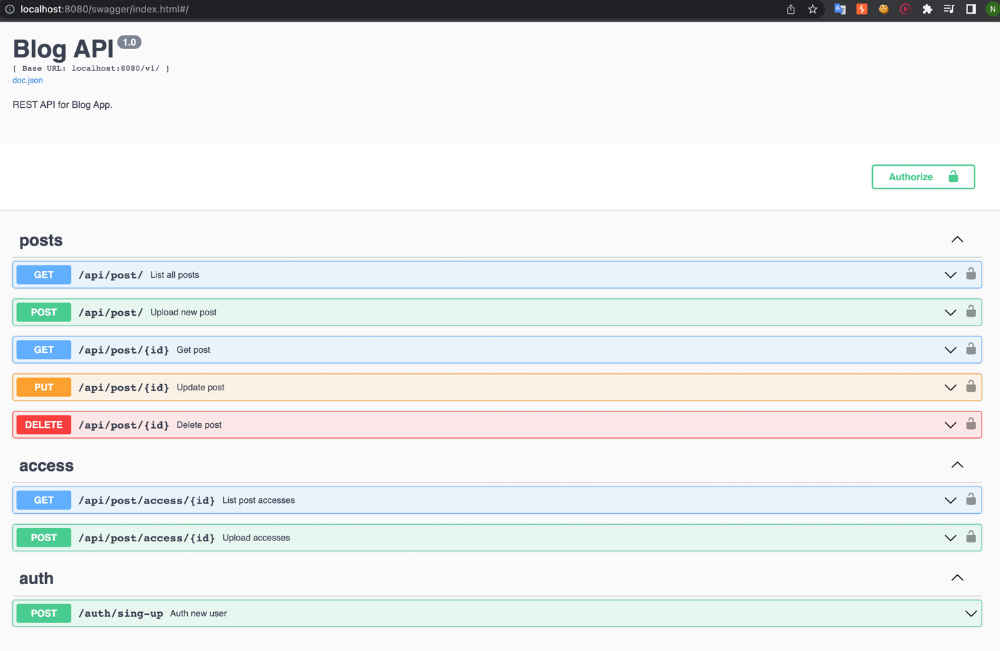

# blog-app

API для блога.

Для запуска:
    
    git clone https://github.com/Kolyan4ik99/blog-app
    cd blog-app
    make

URL для всех запросов

    http://localhost:8080/v1/

После запуска, можно открыть swagger:
    
    http://localhost:8080/swagger/index.html#/

1) Первый шаг - авторизоваться (email должен быть уникальным):

        Request:
        POST /auth/sign-up
        {
        "name": "NameNewUser",
        "password": "14125",
        "email": "mailForNewUser@gmail.com"
        }

        Response:
        status: 201
        user_id: 1

### В следующих запросах использовать header "Authorization": "Ваш токен"

2) Создать новый пост. ttl - время жизни записи. Когда ttl станет меньше текущей даты и времени, запись удалится в течении минуты. 
(Scheduler вычитывает все записи в условии и удаляет):

        POST /api/post/
        {
        "author": 1,
        "header": "Interesting title your post",
        "text": "Useful text for my post",
        "ttl": "2022-10-11T12:05:41+04:00"
        }

        Headers: "Authorization": "..." // Добавлять этот хедер в каждом запросе

        Response:
        status: 201
        {
        "Message": "post_id: 7"
        }

Получить все существующие посты:

    GET /api/post/

    Response:
    status: 200
    [
    {
    "id": 6,
    "author": 1,
    "header": "Interesting title your post",
    "text": "Useful text for my post",
    "ttl": "2022-09-12T12:05:41Z",
    "created_at": "2022-09-12T00:12:37.766744Z"
    },
    {
    "id": 7,
    "author": 1,
    "header": "Interesting title your post",
    "text": "Useful text for my post",
    "ttl": "2022-10-11T12:05:41Z",
    "created_at": "2022-09-12T00:37:25.250112Z"
    }
    ]

Получить пост по id:

    GET /api/post/6

    Response:
    status: 200
    {
    "id": 6,
    "author": 1,
    "header": "Interesting title your post",
    "text": "Useful text for my post",
    "ttl": "2022-09-12T12:05:41Z",
    "created_at": "2022-09-12T00:12:37.766744Z"
    }

    GET /api/post/51235 // Поиск не существующего post'а

    Response 
    status: 404

Обновление поста по id:

    PUT /api/post/6
    {
    "header": "Interesting title your post",
    "text": "Useful text for my post",
    "ttl": "2022-10-11T12:05:41+04:00"
    }

    Response
    {
    "id": 6,
    "author": 1,
    "header": "Interesting title your post",
    "text": "Useful text for my post",
    "ttl": "2022-10-11T12:05:41Z",
    "created_at": "2022-09-12T00:12:37.766744Z"
    }
    status: 200

Удаление поста по id:

    DELETE /api/post/6

    Response
    status: 200

## Как работает time_to_live:

Реализовал scheduler который раз в минуту проверяет записи в целевой таблице. 
Если ttl у записи меньше time.Now(), то запись устарела и её удаляем.

## Как настроить уровень доступа к записям:

Открыть доступ к записи всем пользователям:

    POST /api/post/access/7
    {
    "is_all": "yes"
    }

    Response
    {
    "Message": "Created"
    }
    status: 201

Закрыть доступ к записи всем пользователям:

    POST /api/post/access/7
    {
    "is_all": "no"
    }

    Response
    {
    "Message": "Created"
    }
    status: 201

Чтобы это проверить, вызываем (is_all: "no" - говорит что закрыт для всех):

    GET /api/post/access/7

    Response
    {
    "post_id": 7,
    "UsersId": [{
        "type": "no"
    }],
    "is_all": "no"
    }
    status: 200
    
Открыть всем кроме пользователя с id = 3:

    POST /api/post/access/7
    {
    "is_all": "yes",
    "UsersId": [{
    "id": 3,
    "type": "no"
    }]
    }

    Response
    {
    "Message": "Created"
    }
    status: 201

Проверяем:

    GET /api/post/access/7

    Response
    {
    "post_id": 7,
    "UsersId": [
    {
    "type": "yes"
    },
    {
    "id": 3,
    "type": "no"
    }
    ],
    "is_all": "yes"
    }
    status: 200
